# 逐跳路由与 BGP：包怎么一跳跳找到目标，全球路由表又怎么来的

> 一个包跨越互联网时，**IP 头里的目标 IP 全程不变**（终点），而**帧头里的目标 MAC 每过一个路由器就重写**（下一跳）。全球路由表，靠各自治系统用 BGP 互相通告、涟漪式拼出来。

## 我追问的链

- 封装到链路层要填"目标 MAC"，可我只有对方 IP，MAC 填谁？对方在地球另一端，根本不在我局域网。
- 包到底怎么一跳跳过去的？路由器在干啥？
- 路由器靠"路由表"决定下一跳——那张表是**谁、怎么填**进去的？
- 骨干网成千上万台路由器，凭什么知道"去某个 IP 往哪走"？→ AS 号、IP 段又是谁发的？

## 核心理解

**反直觉真相**：你**既不需要、也不可能**知道地球对面那台机器的 MAC。

- **目标 IP（网络层）= 终点**，从头到尾不变。
- **目标 MAC（链路层）= 下一跳**，每过一个路由器换一次。

寄快递里：快递单最终地址（IP）不变；"这箱货此刻交到谁手上"（MAC）每段都变。

**出门第一判断**：对方 IP 和我是否同一局域网？靠**子网掩码**（一把尺子，量出 IP 里哪几位是"小区编号"）。

- 同网段：用 **ARP（Address Resolution Protocol，地址解析协议）**——在局域网里广播"谁是 192.168.1.20？报你的 MAC"，对方私下回 MAC。
- 不同网段：把包交给**网关**（小区门口），这时 ARP 问的是**网关的 MAC**。注意此时 `目标IP=终点` 但 `目标MAC=网关`。

**路由器接力**（每台都重复）：拆帧头 → 看 IP 头目标 IP → **查路由表**定下一跳 → **重写一个新帧头**（目标 MAC=下一跳）发出。IP 头纹丝不动，帧头每跳重写。（家用路由器还在这步做 [NAT](01-intranet-penetration.md)，把源 IP 换成公网 IP。）

**路由表三个来源**：直连（插网线自动有）、静态（人工配）、**动态（路由协议自动学）**。骨干全靠动态。

**全球路由怎么来的**：互联网是一个个 **AS（Autonomous System，自治系统——单一机构统管的网络"王国"，有自己的编号）**。

- AS 内部用 OSPF 这类"内政"协议。
- AS 之间用 **BGP（Border Gateway Protocol，边界网关协议）**："经过我能到这些网段"，邻居再转告邻居，**像涟漪一样扩散全网**，每台路由器据此拼出路由表。

**为什么会绕路**：BGP 默认选 **AS_PATH 最短**（经过的 AS 数最少），不是地理最近、也不是最快，还叠加商业策略——这就是跨国拉镜像又绕又慢的根。**BGP 劫持/泄漏**（有人误通告了不属于它的网段）能让大片流量被吸走，是"某区域突然访问不了"的常见原因。

## 逻辑闭环 / 锚点

追到最底：**IANA（Internet Assigned Numbers Authority）发放 AS 号 + IP 段 → 各 AS 工程师人工配 BGP 邻居 + 签商业互联协议 → BGP 自动扩散可达信息 → 路由表被填满**。互联网连成一张网，地基不是中央调度，而是**物理 + 人工配置 + 商业合同**。

## 关联

- 母题 [追到最底，是物理 / 人 / 商业](../patterns.md)。
- Anycast（多机共用一个 IP、靠 BGP 引到最近）是 [08-load-balancing-cdn](08-load-balancing-cdn.md) 就近接入的底层。

---

*来源：与 Claude 的对话，2026-06。*
