# TCP：在"会丢包"的 IP 之上，盖出可靠、有序、不重不漏的字节流

> IP 只会"尽力而为"地丢包/乱序。TCP 用 **序号 + 确认 + 重传** 三件套造可靠；用 **三次握手/四次挥手** 管连接的生死；用 **滑动窗口 + 拥塞控制** 让数据又快又稳。

## 我追问的链

- IP 不保证送达，那"可靠"是怎么补出来的？
- 握手**为什么非得三次**？两次差在哪？挥手**为什么是四次**、还要 TIME_WAIT？
- 既然 C→S 通了，**为什么 S→C 不一定通**？"全双工"到底啥意思？
- 数据怎么传才不慢、又不把网络挤爆？

## 1. 可靠的基石：编号 + 确认 + 重传

- **序号 seq**：每个字节都编号。
- **确认 ack**：`ack=100` 表示"前 99 个我都收齐了，请从 100 发"（累计确认）。
- **超时重传**：迟迟没等到 ack，就当丢了，重发。

握手、挥手、滑窗，全建在这三件套上。

## 2. 三次握手：为什么是三次

握手在确认"**我发的你能收到、你发的我能收到**"，并交换各自初始序号。因为 TCP 全双工有**两个方向**，每个方向都要被确认：

1. C→S `SYN`(seq=x)
2. S→C `SYN+ACK`(ack=x+1, seq=y)
3. C→S `ACK`(ack=y+1)

**两次为什么不够**：第二步结束，**客户端**其实双向都确认了，但**服务器**只确认了 C→S——它发的 SYN+ACK 有没有到客户端，它**没有证据**。第三个 ACK 就是补上这个证据。三次 = 双向都被确认的最小次数。

## 3. 四次挥手 + TIME_WAIT：为什么比握手多一次

握手能把"确认你 + 我也要连"合成一个包（SYN+ACK）；挥手不行——Client 说完不代表 Server 说完，Server 要先 `ACK`、把剩下数据发完、再单独 `FIN`（半关闭），所以拆成四步。

**TIME_WAIT**：主动关闭方发完最后的 ACK 后再等 `2×MSL`，怕这个 ACK 丢了对方会重发 FIN（自己还在就能补发），也让残留旧包自然消亡。→ CI 里海量短连接会堆积 TIME_WAIT 占满端口，所以要 keep-alive 复用连接。

## 4. 全双工：为什么 C→S 通推不出 S→C 通

**全双工** = 一条连接里**两条独立的流**，可同时收发（打电话能同时说；半双工像对讲机要轮流）。

"通"指的不是物理连着，而是"**我发的，对方真收到了**"——而在会丢包的 IP 上，**"发出去" ≠ "收到"**，唯一证据是回执。所以两个方向得各自拿到回执。现实里它们也真会不对称：[NAT](01-intranet-penetration.md) 单向放行、[BGP](04-routing-bgp.md) 非对称路由、单向丢包。

> 追到底：第三个 ACK 客户端又怎么确认服务器收到了？理论上能无限套娃（"两军问题"，逻辑上无解）。TCP 务实——三次已让双方各拿到一次证据，够开工；剩下的丢包交给数据阶段的 ack+重传兜底。

## 5. 滑动窗口 + 流量控制

"发一个等一个 ack"（停等）太慢——每个包都干等一个 RTT。**滑动窗口**：允许"一窗在途、未确认"的数据一起发，收到 ack 窗口就向前滑。窗口要 ≥ **BDP（带宽时延积 = 带宽 × RTT）** 才跑满带宽。

**流量控制**：接收方在 ack 里捎带 **rwnd**（我还能收多少），防止发太快淹死接收方——明着喊的限速。

## 6. 拥塞控制：网络堵了自己退让

中间网络堵了不会通知你，只会**默默丢包**。发送方自己维护 **cwnd（拥塞窗口）**，靠丢包猜拥堵：

- **慢启动**：每 RTT 翻倍（指数飙升；名字叫"慢"只因起点低）。
- 到 **ssthresh** 转 **拥塞避免**：每轮 +1，线性慢爬。
- 一丢包：**窗口砍半**，重新爬（这套"加性增、乘性减"AIMD 就是锯齿的来历）。

**真正能发** = `min(rwnd, cwnd)`：一个看接收方能力，一个看网络能力，取更紧的。→ 跨国"长肥管道"BDP 大、又有丢包，cwnd 长期被压小，所以拉大镜像慢；CDN 缩短 RTT/减少丢包来救，BBR 换一种不以丢包为唯一信号的算法来救。

## 逻辑闭环 / 锚点

可靠（seq/ack/重传）→ 连接（握手/挥手）→ 高效不添乱（滑窗 + 流控 + 拥塞）。从"IP 尽力而为"补到"应用拿到一条快稳可靠有序的字节流"，全是 TCP 这层的功劳。

## 关联

- 全双工 = 两条独立流，也解释了握手三次、挥手四次。
- 拉取慢/超时/重传的 CI 痛点，根在第 5、6 节。下一层安全见 [06-tls](06-tls.md)。

---

*来源：与 Claude 的对话，2026-06。*
