# TLS / HTTPS：在谁都能偷听的线上，安全又认得出对方

> HTTPS = HTTP over TLS。TLS 在 TCP 握完手后**再握一次手**，解决两个难题：**防偷听**（混合加密 + DH 换钥匙）和**防冒充**（证书 + CA + 信任链）。

## 我追问的链

- HTTPS 凭什么没法被偷看？密钥怎么在一条公开线路上安全交换？
- 我怎么确定对面**真是它**、不是中间人冒充？
- 我用 CA 公钥验签——可我凭什么信这个 **CA**？这不又绕回去了吗？

## 难题一：防偷听

**对称加密**（一把钥匙加解密）又快又好，死结是：**钥匙怎么隔着公开线路交给对方**而不被偷听？

**非对称加密**（公钥 + 私钥）破局：公钥加密的只有私钥能解，公钥可公开。像**带投信口的邮箱**：谁都能投（公钥加密），只有你能取（私钥解密）。

但非对称**慢**，所以 TLS 用**混合加密**：开头用非对称安全协商出一把对称钥匙，之后海量数据用快的对称加密传。

更进一步用 **DH（Diffie-Hellman 密钥交换）**：双方**不传钥匙，各自算出同一把**——

> 调色类比：公共色（黄）公开；你私选红、对方私选蓝（不说）；各自调出 黄+红=橙、黄+蓝=绿，**公开交换**；你把绿+红、对方把橙+蓝，都得到 黄+红+蓝（同一色）。中间人只看到 黄/橙/绿，**从橙里分离出红做不到**（混合易、逆向极难），算不出最终色。

每次连接用临时私密色 → **前向保密**：私钥日后泄露也解不了旧流量。

## 难题二：防冒充（光加密不够）

**加密只保证没人偷看，不保证对面是谁。** 中间人（MITM）可以一上来就冒充服务器跟你做 DH，你浑然不觉。所以要证明"**这个公钥确实属于这个域名**"。

- **数字证书** = 把【公钥 + 域名 + 有效期】打包，由 **CA（Certificate Authority，证书颁发机构）** 签发。像公安局签发的身份证。
- **数字签名**（非对称**反着用**：私钥签名、公钥验证）：CA 把证书内容的**哈希**用 CA 私钥加密 = 签名；你用 CA 公钥验签 + 自己算哈希对比，对得上就证明"确是这家 CA 签的、没被改"。像火漆印章——只有 CA 有那个章，但谁都能认。
- 你收到证书后查三样：**验签 + 对域名 + 看有效期**，全过才拿它的公钥去换钥匙。

## 信任链 + 根内置（追到底的闭环）

"凭什么信 CA"——靠**信任链**：服务器证书由中间 CA 签、中间 CA 由根 CA 签，一级担保一级。

链的尽头是**根 CA**，它**自签名**、没有上级，凭什么可信？凭——**根证书出厂就内置在你的操作系统/浏览器里**。这就是**信任锚点**。

> 这和 [02-dns](02-dns.md) 的"根服务器 IP 内置、本地 DNS 靠 DHCP 给"是**同一个套路**：任何层层追问的体系，最底都得有个出厂钉死的锚点，否则无限递归。

## 完整握手（合体）

1. Client Hello（套件 + 随机数）
2. Server Hello + **证书链**（+ 随机数）
3. **验证证书链**（追到内置根 + 对域名 + 有效期）= **先验身份，防冒充**
4. **DH 换钥匙** = **再安全换钥匙，防偷听**
5. 之后对称加密通信

精髓在顺序：**先确认对面是谁，再跟它换钥匙。**

## 落到 CI/CD

- `x509: certificate signed by unknown authority`：链追到的根不在你机器内置库里（公司自建 CA / 内网）→ 把公司根证书装进信任库。
- 自签证书：信任链追不到内置根 → 报警。
- 证书过期：第三关没过。
- `curl -k`：跳过证书校验 = 关掉身份验证，只防偷听不防冒充（危险）。

## 关联

- 母题 [信任的内置锚点](../patterns.md)；非对称加密既能"加密"也能"签名"（正反两用）。

---

*来源：与 Claude 的对话，2026-06。*
