# WebSocket / socket / HTTP·TCP·UDP：双向长连接，以及理清"协议"与"接口"

> WebSocket 借一个 HTTP 请求**升级**成双向常开的通道，复用的正是 TCP 早就有的全双工。顺带把最容易混的几个词理清：HTTP/TCP/UDP 是**协议**，socket 是**接口**。

## 我追问的链

- HTTP 只能一问一答，服务器想主动推消息怎么办？
- 服务器凭什么能"主动推"？不是会被 NAT 挡吗？
- HTTP、TCP、UDP、socket 到底什么关系？socket 和 WebSocket 又不一样？
- socket 是对 TCP 的封装吗？为什么 WebSocket **一定**是 TCP？

## 1. HTTP 的死穴与 WebSocket 的升级

HTTP 是**请求-响应**：服务器只能被动等你问，没法主动开口（何况主动连你还会被 NAT 挡）。早期靠**轮询/长轮询**硬凑，笨重。

WebSocket 的巧思：**借一个 HTTP 请求升级**——客户端发带 `Upgrade: websocket` 的 GET（长得就是 HTTP，能穿过认识 HTTP 的代理/防火墙），服务器回 `101 Switching Protocols`，**同一条 TCP 连接从此改说 WebSocket、双向常开**，底层 TCP 连接一直不关。之后用轻量的**帧**互发，ping/pong 心跳保活。

## 2. 服务器凭什么能主动推（内网穿透闭环）

> 服务器能推，**不是它重新连了你**（陌生入站会被 NAT 挡），而是它在**你先建好的那条全双工连接的回程方向**上发数据。

这跟 [01-内网穿透](01-intranet-penetration.md) **一模一样**：先由里往外建一条连接并保持，之后两个方向都能走。WebSocket 把这个手法标准化了。保活心跳也对应内网穿透的"保持隧道不断"——对付 NAT 的空闲回收。

## 3. 理清 HTTP / TCP / UDP / socket（它们不在一个维度）

- **HTTP、TCP、UDP 是「协议」**（通信的规矩）；**socket 是「接口」**（程序收发网络的把手），不是协议。
- 协议还分层：HTTP 在应用层，TCP/UDP 在传输层。

一句话框架：**你的程序，通过 socket 这个插口，挑 TCP 或 UDP 来运货，货按 HTTP 这样的格式打包。**

- **TCP vs UDP**：TCP 像挂号信（可靠有序，要握手/重传）；**UDP（User Datagram Protocol）**像扔明信片（不保证送达/顺序，但快）。要可靠就 TCP；宁丢不等（实时视频、游戏、DNS）就 UDP。
- **socket（套接字）**：操作系统给的"网络插口"，往里写=发、从里读=收，底层 TCP 的脏活它替你干。`socket()/bind()/listen()/accept()` 都是对它的操作。一条连接由**五元组**唯一确定：`(协议, 源IP, 源端口, 目的IP, 目的端口)`——这就是一台服务器一个 80 端口能同时服务上万客户端的原因（每条连接五元组不同）。

## 4. 两个易混点的精确答案

- **socket vs WebSocket**：socket 是**接口**，WebSocket 是**应用层协议**（和 HTTP 平级，骑在 TCP 上）。名字撞脸，维度不同；它俩是协作关系——WebSocket 的数据最终还是写进一个 TCP socket 发出去的。（浏览器出于安全不给网页裸 socket，只开放受控的 HTTP/WebSocket，这正是 WebSocket 存在的深层原因。）
- **socket 是封装 TCP 吗**：方向对（它把 TCP 脏活藏起来了），但封装的不是"TCP"，而是"**使用各种传输方式**"——`SOCK_STREAM`→TCP、`SOCK_DGRAM`→UDP，换个参数就换协议。它是**接口**，TCP 是**实现**；底层靠"一切皆文件 / 文件描述符"统一抽象。
- **WebSocket 为什么一定 TCP**：①它要可靠有序，只有 TCP 给；②UDP 是无连接的，连"一条连接"都没有，撑不起"常开连接"的模型；③它本就是从一条 TCP 原地升级来的，没法升级到 UDP。严格说，它要的是"**一条可靠、有序、常开的连接**"——TCP 是经典提供者，HTTP/3 的 QUIC（在 UDP 上重建连接）是新提供者，但**裸 UDP 给不了**。

## 逻辑闭环 / 锚点

WebSocket 踩在两个巨人肩上：HTTP（混过中间设施的兼容性）+ TCP（全双工、可靠常开）；一次 101 升级甩掉一问一答。它能主动推的底气，就是 [01](01-intranet-penetration.md) 那条"已建立的连接双向可走"。

## 关联

- 母题 [已建立连接双向可走](../patterns.md)、[分层 + 封装](../patterns.md)。

---

*来源：与 Claude 的对话，2026-06。*
