# 负载均衡 / CDN：一台扛不住怎么分流，内容怎么就近用户

> 一台机器有上限就加机器，再用**负载均衡器**把请求分到多台后端（L4 看 IP+端口、L7 看 HTTP）；**CDN** 把内容缓存到全球边缘节点，靠 DNS + Anycast 让用户就近访问。

## 我追问的链

- 一台服务器扛不住了，加机器之后，用户请求怎么知道该去哪台？
- 那个分流的负载均衡器**自己**挂了怎么办？一个 IP 怎么指向多台？
- 跨国访问为什么慢，CDN 怎么"就近"接住我？

## 1. 负载均衡：站在最前面的调度员

用户只连一个入口，调度员把请求转发给后面某台后端。**在哪一层分**正好呼应 [分层](03-layering.md)：

- **L4（四层，传输层）**：只看 IP + 端口（五元组那层），转发整条 TCP 连接，不看内容。快。
- **L7（七层，应用层）**：拆开看 HTTP（URL、Host、Cookie），按内容路由（`/api` 给一组、图片给另一组）。聪明但开销大。

> L4 像只看快递面单地址分拣；L7 像拆开看里面装啥再决定送哪。

策略：轮询、最少连接、IP 哈希（同一用户固定一台 = 会话保持）。

## 2. 调度员自己别成单点

负载均衡器也要冗余：多台 + 健康检查（探后端死活、挑掉坏的）+ 故障转移。那"一个域名怎么落到多台 LB、还就近"——又绕回学过的两招：

- **DNS 负载均衡**：一个域名解析返回多个 IP，或按地理返回不同 IP。
- **Anycast（任播）**：多台机器**共用同一个 IP**，靠 [BGP](04-routing-bgp.md) 把用户引到网络上最近的那台。

## 3. CDN：把内容搬到离用户最近的地方

跨国访问慢的根：RTT 大 + 丢包，[TCP 拥塞窗口](05-tcp.md)被压得很小。**CDN（Content Delivery Network，内容分发网络）** 在全球放成百上千个**边缘节点**，缓存静态内容让用户就近取。

"就近"还是 DNS + Anycast：查域名时智能 DNS 按你的位置返回最近的边缘 IP。好处不止缓存：

- 就近 → RTT 小 → TCP/TLS 握手快、拥塞窗口能开大 → 真的快。
- 边缘就近帮你做 [TLS 握手](06-tls.md)，再省跨国往返。
- 海量节点吸收流量、扛 DDoS。
- 没缓存就**回源**——回真正的源站取一次、缓存下来，下次就快。

## 终极闭环：一次访问大网站

把这八篇全串起来：

1. **DNS** 返回就近节点 IP（Anycast / BGP）
2. 连上最近的 **CDN 边缘**，就近做 TCP + TLS 握手
3. 边缘**命中缓存**就直接返回；未命中**回源**
4. 回源到**负载均衡器**（L4 / L7 分发）
5. 分到**后端某台服务器**（socket / 五元组区分连接）→ 处理 → 返回

## 逻辑闭环 / 锚点

调度的尽头又落回 **DNS + BGP**——前面学的全在这复用了。CI/CD 里报错从此能定位到层：超时→TCP；`x509`→TLS 信任链；跨区奇慢→BGP 绕路 + 该上 CDN；时通时不通→DNS / Anycast / BGP 泄漏。

## 关联

- 用到了几乎所有前序篇；Anycast 的底层是 [04-routing-bgp](04-routing-bgp.md)，就近提速的原理是 [05-tcp](05-tcp.md) 的 RTT 与拥塞窗口。

---

*来源：与 Claude 的对话，2026-06。*
