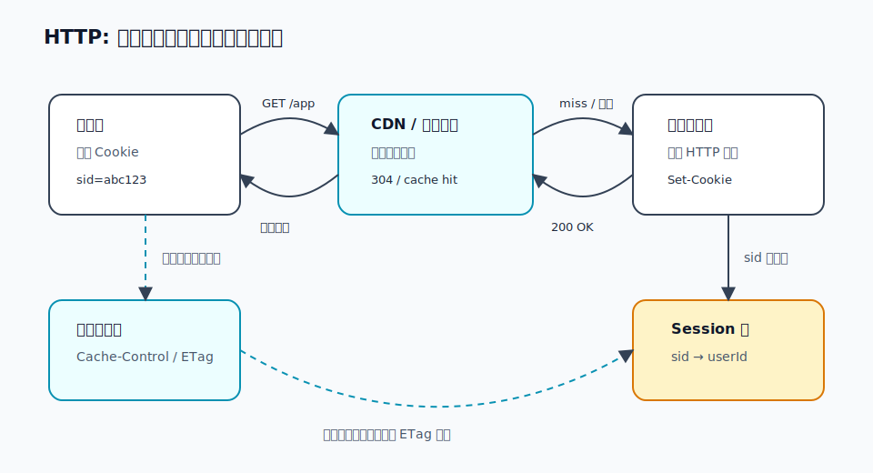

# HTTP / 缓存 / Cookie / Session：一问一答的协议，怎么变快、怎么记住你

> HTTP 是应用层的"请求-响应"规矩：客户端问，服务器答。它天生**无状态**，每次请求都像第一次见面；缓存让重复内容少问几次，Cookie + Session 让服务器能认出"还是刚才那个人"。

## 我追问的链

- TCP/TLS 已经把路修好了，那 HTTP 到底在路上说了什么？
- 浏览器为什么第二次打开网页会快？它凭什么敢不重新下载？
- HTTP 不是无状态吗？网站怎么知道我已经登录过？
- Cookie 和 Session 到底谁存在哪里？JWT 又和它们是什么关系？

## 1. HTTP：在可靠通道上说"请求-响应"

前面几篇已经把路铺好：

1. [DNS](02-dns.md) 找到 IP
2. [TCP](05-tcp.md) 建起可靠字节流
3. [TLS](06-tls.md) 加密并确认对方身份
4. HTTP 才开始在这条安全通道上说业务话

HTTP 的基本形状很朴素：

```http
GET /profile HTTP/1.1
Host: example.com
Cookie: sid=abc123
Accept: text/html
```

服务器回：

```http
HTTP/1.1 200 OK
Content-Type: text/html
Cache-Control: private, max-age=60

<html>...</html>
```

拆开看就三块：

- **起始行**：我要干什么（`GET /profile`）/ 结果如何（`200 OK`）。
- **Header**：附加说明，像快递面单上的备注：我是谁、能收什么、能不能缓存、有没有 Cookie。
- **Body**：真正的内容，可能是 HTML、JSON、图片、文件。

HTTP 自己不管"包丢了怎么办"、"密钥怎么换"、"路由怎么走"。那些是下面几层的活。它只管应用层的对话格式。

## 2. 无状态：每次请求都像重新排队

HTTP 的一个关键性格：**无状态（stateless）**。

意思不是服务器完全不能存东西，而是说：**协议本身不记得上一次请求**。你刚刚请求了 `/login`，下一秒请求 `/profile`，从 HTTP 这层看，这就是两个独立请求。

像去窗口办事：

- 你第一次说："我要登录。"
- 工作人员答："可以。"
- 你第二次说："我要看我的资料。"

如果你第二次不带任何凭据，工作人员凭什么知道你就是刚才登录的人？不能靠脸熟，因为 HTTP 每次请求都可能经过不同连接、不同代理、不同服务器。

所以要额外补一个"记忆机制"：Cookie + Session。

## 3. Cookie：浏览器自动夹带的小纸条

**Cookie 是服务器让浏览器保存、以后自动带回来的小段文本。**

登录成功时，服务器可能这样回：

```http
HTTP/1.1 200 OK
Set-Cookie: sid=abc123; Path=/; HttpOnly; Secure; SameSite=Lax
```

浏览器记住这张"小纸条"。以后访问同一个站点时，自动带上：

```http
GET /profile HTTP/1.1
Host: example.com
Cookie: sid=abc123
```

这就是 Cookie 的本质：**不是浏览器主动懂业务，而是浏览器按域名和规则自动替你带凭据**。

几个常见属性：

- `Domain` / `Path`：这张纸条给哪个域名、哪个路径用。
- `Expires` / `Max-Age`：什么时候过期。
- `Secure`：只在 HTTPS 下发送。
- `HttpOnly`：不让 JavaScript 读取，降低 XSS 偷 Cookie 的风险。
- `SameSite`：限制跨站请求时是否携带，减少 CSRF 风险。

Cookie 不神秘，也不天然安全。它只是文本，浏览器会替你保存和携带；真正的安全来自 HTTPS、合理的属性、服务端校验和过期策略。

## 4. Session：服务器那边的"号码牌"

如果 Cookie 只是小纸条，那登录态到底放哪？

经典做法是 **Session**：

1. 用户登录成功。
2. 服务器生成一个随机 `sid`。
3. 服务器把 `sid -> 用户信息/登录状态` 存到自己的 Session 表里。
4. 服务器把 `sid` 通过 `Set-Cookie` 发给浏览器。
5. 浏览器以后每次带 `Cookie: sid=...`。
6. 服务器拿 `sid` 去 Session 表查：哦，这是用户 42，已登录。



类比一下：

- **Cookie 里的 `sid`**：你手里的取餐号。
- **服务器 Session 表**：店里屏幕后面的订单本。
- 取餐号本身不等于饭，它只是让店员能查到你的那份饭。

所以：

- Cookie 通常在**浏览器端**。
- Session 通常在**服务器端**。
- Cookie 可以只存一个随机 ID，不必把用户隐私全塞进去。

这也解释了集群问题：如果后端有很多台服务器，A 机器登录写了 Session，下一次请求被负载均衡到 B 机器，B 查不到怎么办？

常见解法：

- **会话保持**：同一个用户尽量打到同一台后端。
- **共享 Session**：把 Session 放到 Redis / 数据库，多台后端一起查。
- **JWT**：把部分身份信息和签名放进 token，服务器验证签名即可，不一定查 Session 表。

JWT 像"带防伪签名的门票"：检票员不用查订单本，只要验证签名没被伪造、没过期。但它也有代价：一旦发出去，想立刻作废就比服务端 Session 麻烦，通常还要黑名单、短过期时间、刷新 token 等机制配合。

## 5. 缓存：能不重复问，就别重复问

HTTP 还有另一条主线：**缓存**。

缓存解决的是："这个东西我刚拿过，能不能别再下载一遍？"

常见位置有三层：

- **浏览器缓存**：你的电脑本地存一份。
- **代理 / CDN 缓存**：离用户更近的中间节点存一份。
- **服务端缓存**：服务器自己把数据库查询结果、页面片段先存起来。

HTTP 主要通过 Header 协商缓存策略。

### 强缓存：没过期就直接用

```http
Cache-Control: max-age=3600
```

意思是：3600 秒内，这份内容可以直接用缓存，不必问服务器。

像冰箱贴了标签："这盒牛奶 1 小时内肯定新鲜。" 这段时间里你直接喝，不用每次打电话问厂家。

### 协商缓存：我有旧版，问问还能不能用

如果缓存过期了，浏览器不一定立刻重新下载完整内容，而是带着"我手里这版的指纹"去问：

```http
If-None-Match: "v1-abc"
```

服务器发现没变，就回：

```http
HTTP/1.1 304 Not Modified
```

`304` 没有完整 Body，意思是："你那份还能用。" 这样省掉下载正文。

常见校验方式：

- `ETag` / `If-None-Match`：用内容指纹判断有没有变。
- `Last-Modified` / `If-Modified-Since`：用最后修改时间判断有没有变。

### 几个容易误解的 Cache-Control

- `max-age=60`：60 秒内直接用缓存。
- `no-cache`：不是"不缓存"，而是"可以存，但每次用前都要向服务器确认"。
- `no-store`：真的不存，敏感内容常用。
- `private`：只能浏览器私有缓存，CDN 这类共享缓存别存。
- `public`：允许共享缓存保存。

缓存是性能工具，但也会制造经典问题：**为什么我明明发布了新版本，用户还看到旧页面？** 往往就是 HTML、JS、图片的缓存策略没配好。工程上常用"文件名带 hash"解决：内容一变，文件名就变，旧缓存自然不会命中新资源。

## 6. 把登录和缓存放到一次访问里

一次真实访问可能这样走：

1. 浏览器请求 `/login`。
2. 服务器校验密码，通过后创建 Session。
3. 服务器回 `Set-Cookie: sid=...`。
4. 浏览器再请求 `/profile`，自动带 `Cookie: sid=...`。
5. 服务器查 Session，知道你是谁，返回个人页面。
6. 页面里的 CSS/JS/图片走缓存：没过期直接用，过期了用 `ETag` 问一嘴。
7. CDN 可以缓存公共静态资源，但不能随便缓存带个人信息的页面。

所以这几个概念不是散的：

- HTTP 负责一问一答。
- Cookie 负责让浏览器以后自动带小纸条。
- Session 负责让服务器用小纸条查出"你是谁"。
- Cache 负责让没变的东西少传几次。

## 逻辑闭环 / 锚点

HTTP 的地基是"无状态请求-响应"。缓存和登录态都是在这个地基上补能力：

- **缓存**：给重复请求补"记忆"，少问少传。
- **Cookie + Session**：给独立请求补"身份连续性"，让网站认得出你。

这和 [05-TCP](05-tcp.md) 很像：IP 本来不可靠，TCP 在上面补出可靠字节流；HTTP 本来无状态，Cookie/Session 在上面补出登录态。底层越简单，上层越靠协议和约定把缺的能力补回来。

## 关联

- [07-WebSocket](07-websocket.md)：HTTP 一问一答，不适合服务器主动推；WebSocket 借 HTTP 升级成长连接。
- [08-负载均衡 / CDN](08-load-balancing-cdn.md)：缓存不只在浏览器，也在 CDN 边缘节点。
- 母题 [分层 + 封装](../patterns.md)，以及"在更弱的底座上补出更强的抽象"。

---

*来源：与 Codex 的对话，2026-07。*
